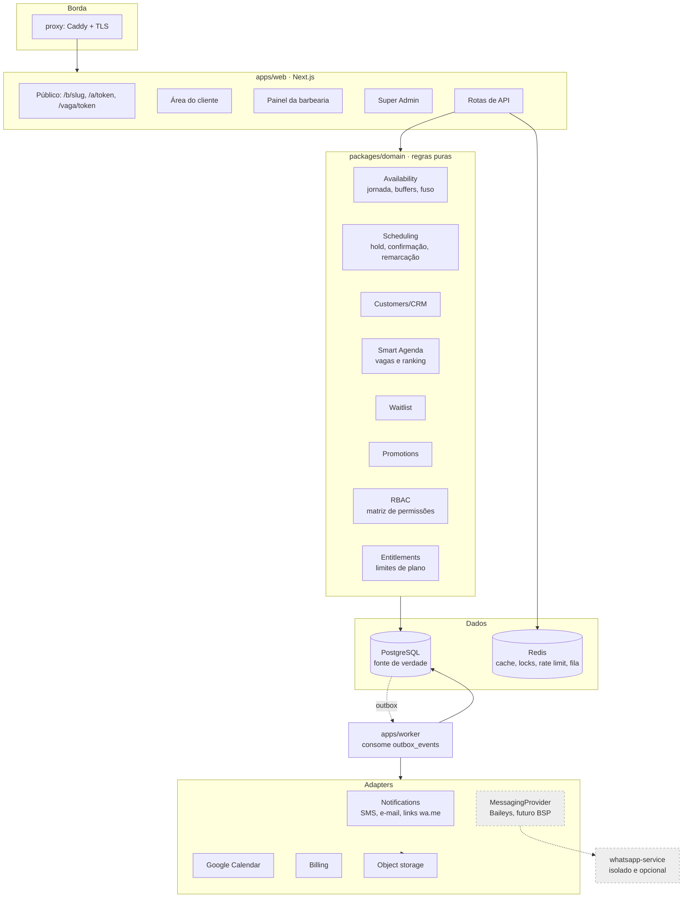
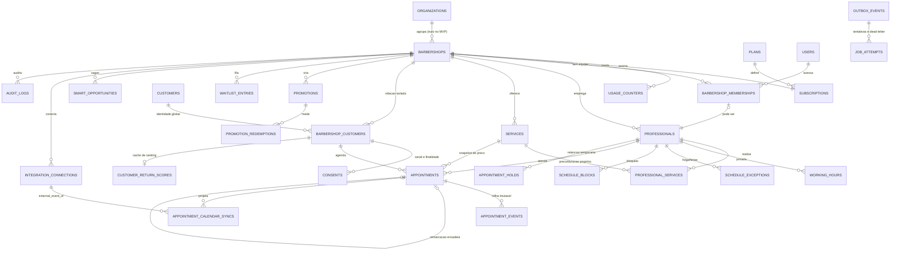

# BARBER SaaS — Entrega pré-desenvolvimento (Parte 3 §15)

Os dez itens exigidos antes de desenvolver. Complementa, sem repetir:
`docs/product-scope-part1.md` (produto), `docs/tech-review-part2.md` (confronto
técnico e decisões #11–#15) e `docs/architecture.md` (stack e garantias).

## 0. O que a Parte 3 muda em relação ao que já estava decidido

| Tema | Antes | Parte 3 | Ação |
|---|---|---|---|
| Hospedagem | Plataforma gerenciada (Vercel/Railway) | VPS Dockerizada, com migração futura para gerenciado | Adotado. `architecture.md` atualizado; Dockerfiles e compose de produção criados. |
| Postgres | Gerenciado | Na VPS no piloto | Adotado, **com a ressalva de RPO no item 10** — é o risco mais sério desta parte. |
| Portas de banco | Compose de dev publica 5432/6379 | Proibido publicar | Separado: `docker-compose.dev.yml` publica (só localhost), `docker-compose.prod.yml` não publica. |
| CI | Não existia | Pipeline de 12 passos | Implementado o núcleo (lint, typecheck, testes com Postgres real, build). |

---

## 1. Decisões técnicas e alternativas

Decisões já tomadas e registradas estão em `architecture.md` §1 e
`tech-review-part2.md` §5. Abaixo apenas as que a Parte 3 introduz, com a
alternativa que foi descartada e o porquê.

| Decisão | Alternativa descartada | Motivo |
|---|---|---|
| Uma VPS com Docker Compose | Kubernetes / plataforma gerenciada | Compose é operável por uma pessoa; k8s é overhead sem ganho no piloto. A saída para gerenciado está preparada (banco, Redis e arquivos são externos por configuração, não por código). |
| Caddy como reverse proxy | Nginx + Certbot | TLS automático e renovação sem cron próprio; menos peça para errar no lançamento. |
| Build de imagem multi-stage com `output: standalone` | Imagem única com todo o `node_modules` | Imagem menor, arranque mais rápido, menos superfície. |
| Postgres e Redis só na rede interna do Docker | Bind em `0.0.0.0` com firewall | Firewall mal configurado é a falha mais comum; não publicar é a defesa que não depende de configuração externa. |
| Migração com `prisma migrate deploy` no deploy, nunca destrutiva automática | `migrate dev` / `db push` em produção | `deploy` só aplica migrações já revisadas; expand/contract manual para mudanças destrutivas (item 6). |
| Staging nunca recebe dump de produção | Dump com anonimização | Anonimização imperfeita é vazamento de dado real de cliente. Staging usa dados sintéticos. |
| Testes de integração contra Postgres real em container | Mock/SQLite | As garantias centrais do produto (exclusão, advisory lock, índice parcial) só existem no Postgres — mock testaria ficção. |

---

## 2. Diagrama dos módulos

Regra de dependência: `domain` não importa React, Prisma nem SDK externo. Quem
fala com banco é a camada de aplicação em `apps/web` e `apps/worker`; o domínio
recebe e devolve dados puros, o que o torna testável sem infraestrutura.

---

## 3. ERD inicial

Fonte de verdade: `packages/db/prisma/schema.prisma`. Relações principais:

Não desenhados por serem transversais: `idempotency_keys`,
`platform_admin_users`, `coupons`.

Pontos do ERD que carregam regra de negócio:

- `barbershop_customers` tem `UNIQUE (barbershop_id, normalized_phone)` — é o que
  impede a relação duplicar a cada agendamento anônimo;
- `appointments` guarda snapshots (preço e nomes) — o histórico não muda quando o
  catálogo muda;
- `appointment_holds` é tabela separada, coordenada com `appointments` por
  advisory lock (constraint de exclusão não cruza tabelas);
- `customers` ↔ `barbershop_customers` é o que garante que uma barbearia nunca
  enxergue o histórico da outra.

---

## 4. Mapa de rotas e telas

O mapa de telas está em `product-scope-part1.md` §4. Abaixo o vínculo com rotas.

### Público (sem sessão)

| Rota | Tela | Estados |
|---|---|---|
| `/b/{slug}` | Página da barbearia | carregando, ativa, barbearia inativa/inexistente |
| `/b/{slug}/agendar` | Wizard (serviço → profissional → data → horário → dados → termos → confirmar) | carregando disponibilidade, hold ativo com contagem, hold expirado, slot perdido com alternativas, erro de validação |
| `/b/{slug}/agendar/sucesso` | Confirmação | com CTAs: calendário, WhatsApp manual, gerenciar, criar conta |
| `/a/{token}` | Gestão sem conta | ativo, cancelado, concluído, no-show, sem permissão de escrita, link inválido/expirado |
| `/a/{token}/remarcar` | Remarcação | reaproveita seleção de data/horário |
| `/vaga/{token}` | Vaga da Agenda Inteligente | disponível, já preenchida, expirada |
| `/espera/{slug}` | Entrada na lista de espera | formulário, confirmação |
| `/entrar` | Autenticação do cliente | telefone → código OTP; fallback por e-mail |

### Área do cliente (sessão de consumidor)

`/minha-conta` (próximos), `/minha-conta/historico`,
`/minha-conta/promocoes`, `/minha-conta/preferencias`,
`/minha-conta/privacidade`.

### Painel (sessão de equipe, tenant resolvido no servidor)

`/hoje`, `/agenda`, `/clientes`, `/clientes/{id}`, `/equipe`,
`/gestao/servicos`, `/gestao/relatorios`, `/gestao/promocoes`,
`/gestao/configuracoes`, `/gestao/integracoes`, `/gestao/assinatura`,
`/gestao/usuarios`, `/agenda-inteligente`, `/lista-de-espera`.

### Super Admin (namespace e autorização separados)

`/admin/barbearias`, `/admin/barbearias/{id}`, `/admin/usuarios`,
`/admin/inadimplencia`, `/admin/cupons`, `/admin/indicadores`, `/admin/logs`.

### API

Rotas públicas conforme Parte 2 §8, já tipadas em
`packages/api-contracts/src/public.ts`. Painel, consumidor e admin entram nos
respectivos marcos.

---

## 5. Contratos principais da API

Implementados em `packages/api-contracts`. Decisões que valem para todos:

- **Idempotência obrigatória** (header `idempotency-key`) em confirmar, cancelar,
  remarcar, webhooks, sincronização e cobrança;
- **Erro tipado** com código estável; `SLOT_UNAVAILABLE` devolve horários
  alternativos em vez de só recusar;
- **Tenant nunca vem do cliente** — é resolvido pelo slug público ou pela sessão;
- **O servidor decide o que é permitido**: `/a/{token}` devolve `permissions`
  calculadas, a UI apenas reflete.

---

## 6. Plano de migrações

Ferramenta: Prisma Migrate. `migrate dev` só em desenvolvimento;
`migrate deploy` no pipeline, aplicando apenas migrações já revisadas.

**Expand/contract obrigatório** para qualquer mudança que possa quebrar a versão
em execução:

1. *Expand* — adicionar coluna/tabela nova, sempre nulável ou com default; deploy.
2. *Backfill* — job idempotente preenche os dados; verificação de contagem.
3. *Migrate* — código passa a ler e escrever no formato novo; deploy.
4. *Contract* — só depois de o formato antigo não ter mais leitor: remover
   coluna/constraint antiga, em migração separada e revisada.

Regras:

- nenhuma migração destrutiva roda automaticamente no deploy;
- `DROP COLUMN`, `DROP TABLE` e renomeação exigem PR próprio, com o passo
  anterior já em produção;
- SQL cru (constraints de exclusão, índice parcial, `btree_gist`) vive dentro da
  migração Prisma, não em script à parte — senão não é versionado;
- toda migração precisa ser testada contra um dump de staging antes de produção;
- rollback: como `migrate` não desfaz, o caminho é *roll forward* (nova migração
  corretiva). Rollback de aplicação (imagem anterior) só é seguro se a migração
  foi expand — mais um motivo para a disciplina acima.

---

## 7. Matriz RBAC

Implementada em `packages/domain/src/rbac.ts` com testes. `OWNER` e `ADMIN`
diferem exatamente no que é irreversível ou financeiro (decisão #11).

| Permissão | OWNER | ADMIN | RECEPTIONIST | PROFESSIONAL |
|---|:--:|:--:|:--:|:--:|
| `barbershop.settings.read` | ✓ | ✓ | ✓ | ✓ |
| `barbershop.settings.write` | ✓ | ✓ | — | — |
| `barbershop.billing.read` | ✓ | — | — | — |
| `barbershop.billing.write` | ✓ | — | — | — |
| `barbershop.transfer_or_close` | ✓ | — | — | — |
| `members.read` | ✓ | ✓ | — | — |
| `members.write` | ✓ | ✓ | — | — |
| `professionals.read` | ✓ | ✓ | ✓ | ✓ |
| `professionals.write` | ✓ | ✓ | — | — |
| `services.read` | ✓ | ✓ | ✓ | ✓ |
| `services.write` | ✓ | ✓ | — | — |
| `schedule.read.all` | ✓ | ✓ | ✓ | opcional¹ |
| `schedule.write.all` | ✓ | ✓ | ✓ | — |
| `schedule.write.own` | ✓ | ✓ | ✓ | ✓ |
| `appointments.read.all` | ✓ | ✓ | ✓ | opcional¹ |
| `appointments.read.own` | ✓ | ✓ | ✓ | ✓ |
| `appointments.write.all` | ✓ | ✓ | ✓ | — |
| `appointments.write.own` | ✓ | ✓ | ✓ | ✓ |
| `customers.read` | ✓ | ✓ | ✓ | opcional¹ |
| `customers.write` | ✓ | ✓ | ✓ | — |
| `customers.notes.read` | ✓ | ✓ | ✓ | — |
| `promotions.read` | ✓ | ✓ | ✓ | ✓ |
| `promotions.write` | ✓ | ✓ | — | — |
| `reports.basic.read` | ✓ | ✓ | ✓ | — |
| `reports.advanced.read` | ✓ | ✓ | — | — |
| `smart_agenda.read` / `.act` | ✓ | ✓ | ✓ | opcional¹ |
| `waitlist.read` / `.act` | ✓ | ✓ | ✓ | — |
| `integrations.read` | ✓ | ✓ | ✓ | ✓² |
| `integrations.write` | ✓ | ✓ | — | ✓² |

¹ Concedida caso a caso pelo dono via `barbershop_memberships.permissions`.
Parte 1 §4.3 diz "conforme permissões" — o padrão é o barbeiro ver só a própria
agenda.
² Apenas a própria conexão de Google Calendar; nunca a de outro profissional nem
a do WhatsApp da barbearia.

Fora desta matriz: `PLATFORM_ADMIN` (namespace separado, impersonação somente
leitura e auditada) e `CUSTOMER` (acessa exclusivamente os próprios dados, via
token de gestão ou sessão de consumidor).

---

## 8. Plano de testes

Mapeado sobre as categorias da Parte 3 §10 e os critérios de aceite da §11.

### Já existente

`packages/db/tests/guarantees.test.mjs` — 14 asserções contra Postgres real:
disputa concorrente do mesmo slot, semântica de ocupação por status, coordenação
hold × confirmação por advisory lock, dedupe de cliente e isolamento entre
barbearias, telefone único só quando verificado.

### Unitários (domínio puro, sem banco)

Disponibilidade (jornada, exceções, bloqueios, buffers antes/depois, antecedência
mínima e janela máxima, virada de dia e fuso); resolução de "qualquer
profissional"; frequência média e ticket; ranking de retorno e seus motivos;
previsto × realizado; RBAC; elegibilidade de plano e de promoção.

### Integração (Postgres e Redis reais em container)

Constraint de conflito; hold, expiração e limpeza; remarcação atômica (novo slot
reservado e anterior liberado na mesma transação); outbox e reprocessamento;
idempotência de requisição repetida; isolamento de tenant em toda query
operacional; retentativa e dead-letter; conexão e revogação de integração.

### End-to-end

Os onze fluxos da §10, com destaque para **dois clientes disputando o mesmo
horário** (já coberto no nível de banco, falta no nível de HTTP) e **integração
externa indisponível** (a reserva precisa continuar válida).

### Segurança

IDOR entre tenants (tentar ler recurso de outra barbearia com sessão válida);
enumeração de token e de telefone; força bruta de OTP com bloqueio progressivo;
elevação de privilégio (RECEPTIONIST tentando escrever serviço, PROFESSIONAL
lendo agenda alheia); CSRF/XSS; rate limiting por IP, tenant, telefone e rota;
ausência de segredo em log e em build; acesso a arquivos de outro tenant.

### Carga

Pico no horário disputado: consulta de disponibilidade, criação de hold e
confirmação. A confirmação serializa por profissional (advisory lock), então a
métrica que importa é latência da fila por profissional, não vazão global.

### Portões de mérito

O pipeline falha se: qualquer teste de garantia falhar; cobertura do domínio cair
abaixo do acordado; migração destrutiva aparecer sem PR próprio; segredo for
detectado no diff.

---

## 9. Backlog por marcos

Marcos conforme Parte 3 §8. Estado atual: **Marco 0 parcialmente concluído**.

**Marco 0 — fundação**
- [x] Monorepo, padrões, ambientes de desenvolvimento (Postgres + Redis em container)
- [x] Schema e migrações, com garantias em SQL testadas
- [x] Multi-tenancy no modelo de dados e teste de isolamento
- [x] Matriz RBAC com testes
- [x] CI: lint, typecheck e testes contra Postgres real
- [x] Empacotamento Docker e compose de produção sem portas de banco expostas
- [ ] Autenticação da equipe (sessão, senha, magic link, recuperação)
- [ ] Middleware de resolução de tenant e guarda de autorização nas rotas
- [ ] Observabilidade básica (log estruturado com request id, health check, Sentry)
- [ ] Deploy de staging na VPS
- [ ] *Saída*: proprietário cria barbearia e acessa painel vazio, isolamento testado

**Marco 1 — configuração operacional**: dados da barbearia e slug; profissionais;
serviços; vínculo profissional–serviço com preço/duração próprios; jornada
semanal com vigência; exceções e bloqueios. *Saída*: agenda válida configurada.

**Marco 2 — motor de agendamento**: motor de disponibilidade; holds; confirmação
transacional; wizard público; tela de sucesso; link seguro; cancelamento;
remarcação atômica; trilha de eventos. *Saída*: fluxo ponta a ponta sem WhatsApp
e sem Google Calendar.

**Marco 3 — painel diário**: Hoje; agenda diária/semanal; reserva manual; status
concluído/no-show; métricas básicas (ao vivo, não materializadas); atalhos de
WhatsApp manual. *Saída*: barbearia opera um dia inteiro.

**Marco 4 — consumidor e CRM**: conta opcional; OTP e magic link; vinculação
segura por telefone verificado; área do cliente; CRM automático por job;
consentimentos versionados; agendar novamente; promoções simples. *Saída*:
relação formada sem vazamento entre barbearias.

**Marco 5 — integrações resilientes**: Google Calendar unidirecional; outbox e
worker em produção; reconciliação; status de integração no painel; mensagens
manuais aprimoradas. *Saída*: integração falha sem corromper reserva.

**Marco 6 — Pro**: detecção de vagas; ranking explicável; link de vaga; lista de
espera; relatórios Pro; entitlements aplicados no servidor.

**Marco 7 — cobrança e administração**: dois planos; assinatura; trial e cupom;
inadimplência e grace period; Super Admin; métricas de suporte.

**Marco 8 — Baileys opcional**: pode ser adiado sem impedir lançamento.

---

## 10. Riscos e dúvidas bloqueadoras

### Risco alto — RPO do banco na VPS

A §4 coloca Postgres na VPS e a §7 trata PITR como algo para "quando o volume
comercial justificar". Com backup diário, a janela de perda chega a 24 horas. Num
sistema de agenda isso não é perda de relatório: a barbearia **deixa de saber
quem vai chegar amanhã**, e o cliente aparece para um horário que o sistema não
tem mais. O dado é pequeno (algumas dezenas de MB por barbearia) e o custo de
arquivar WAL contínuo para storage externo é baixo.

Recomendação: **WAL archiving desde o piloto**, não depois. Proposta de registro
formal (a §7 exige RPO e RTO declarados):

- **RPO ≤ 5 minutos** (WAL arquivado continuamente para storage externo);
- **RTO ≤ 2 horas** (runbook de perda da VPS, com restauração ensaiada).

### Risco alto — VPS única é ponto único de falha

Web, worker, Postgres e Redis no mesmo host: uma falha de disco derruba operação
e dados ao mesmo tempo. Mitigação para o piloto: backup externo + runbook +
ensaio mensal de restauração (a §7 já exige, e o teste é o que torna o backup
válido). Mitigação estrutural: banco gerenciado assim que houver receita.

### Risco médio — "produção pronta" depende de restauração testada

A §16 proíbe declarar produção pronta sem restauração, isolamento e disputa de
slot testados. Isolamento e disputa de slot **já estão testados**; restauração
não — e não pode ser testada aqui, porque depende da VPS real. É item de
bloqueio do lançamento, não do desenvolvimento.

### Risco médio — staging com dado real

A §3 exige staging separado, mas não proíbe dump de produção. Copiar base real
para staging expõe telefone e histórico de clientes reais num ambiente com menos
controle. Decisão adotada: staging usa dados sintéticos.

### Risco médio — carga concentrada no mesmo profissional

O advisory lock serializa confirmações por profissional. É o que garante
correção, mas significa que uma promoção divulgada para muita gente no mesmo
horário forma fila. Precisa ser medido no teste de carga antes do lançamento
controlado.

### Dúvidas que continuam bloqueando o lançamento (não o desenvolvimento)

Sem mudança desde a Parte 2; nenhuma impede os Marcos 0–3:

1. **Nome e domínio** — bloqueia TLS, e-mail remetente e formato do link público.
2. **Provedor de SMS/OTP** — bloqueia o Marco 4.
3. **Provedor de cobrança** — bloqueia o Marco 7. Se Pix/boleto entrar, o
   provedor precisa ser nacional.
4. **Limites numéricos dos planos** — bloqueia os entitlements do Marco 6.
5. **Textos legais versionados** — bloqueia a **primeira reserva real**, porque o
   consentimento grava a versão do texto aceito. É o mais urgente dos cinco.

Sobre o item 5: dá para desenvolver o Marco 2 inteiro com um texto de
desenvolvimento versionado como `dev-0`, mas nenhuma barbearia real pode receber
cliente antes do texto jurídico definitivo.
